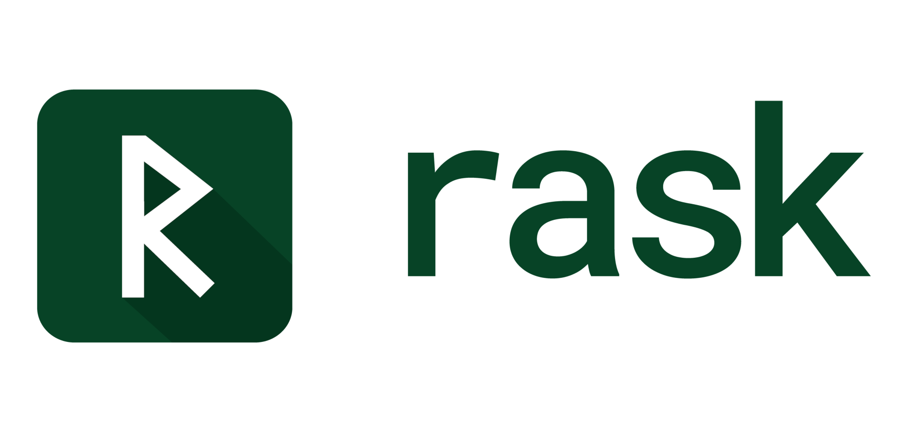

<p align="center">
  <picture>
    <source media="(prefers-color-scheme: dark)" srcset="docs/book/src/assets/rask-logo-white@3x.png">
    <source media="(prefers-color-scheme: light)" srcset="docs/book/src/assets/rask-logo-dark@3x.png">
    
  </picture>
</p>

A research language exploring one question: **what if references can't be stored?**

Rask sits somewhere between Rust and Go — memory safety without lifetime annotations or garbage collection, by making references temporary. They can't be stored in structs or returned from functions.

It's a hobby project. I'm figuring out how far this approach can go. **[Why a new language?](WHY_RASK.md)**

**Status:** Cranelift backend compiles and runs programs natively; interpreter available as a fallback. Core language works end-to-end. Some codegen regressions open — see [issues](https://github.com/rask-lang/rask/issues).

---

## Quick Look

```rask
func search_file(path: string, pattern: string) -> () or IoError {
    const file = try fs.open(path)
    ensure file.close()

    for line in file.lines() {
        if line.contains(pattern): println(line)
    }
}
```

Full example: [grep_clone.rk](examples/grep_clone.rk)

---

## Getting Started

### Prerequisites

You need the Rust toolchain to build from source. If you don't have it:

```bash
curl --proto '=https' --tlsv1.2 -sSf https://sh.rustup.rs | sh
```

### Build

```bash
git clone https://github.com/rask-lang/rask.git
cd rask/compiler
cargo build --release
```

### Add to PATH

```bash
export PATH="$PWD/target/release:$PATH"
```

Add to your shell profile (`~/.bashrc`, `~/.zshrc`) to make it permanent.

### Run

```bash
cd ..
rask run examples/hello_world.rk
```

### What you can do

```bash
rask run <file>       # execute a .rk program
rask check <file>     # type-check only
rask lint <file>      # style/idiom check
rask fmt <file>       # auto-format
```

### Next steps

- Browse [examples/](examples/) for working programs
- Try the [tutorials](tutorials/) — hands-on challenges with built-in reference
- Read the [Language Guide](LANGUAGE_GUIDE.md) for the full explanation

---

## The Idea

**No storable references.** The core experiment. You can borrow a value for a function call or expression, but you can't store that borrow in a struct or return it. This sidesteps lifetime annotations entirely. For graphs and cyclic structures, you use handles (validated indices) instead of references.

**No garbage collection.** Cleanup is deterministic — values are freed when their owner goes out of scope. For I/O resources (files, sockets, transactions), `ensure` guarantees cleanup even on early returns.

**Composition over inheritance.** Structs hold data, traits define behavior, `extend` blocks attach methods. No inheritance hierarchies; runtime polymorphism only when you explicitly opt in with `any Trait`.

### What's decided

| Concept | What it means |
|---------|---------------|
| **Value semantics** | Everything is a value — no hidden sharing, no reference types |
| **Single ownership** | Every value has one owner; cleanup is deterministic |
| **Two-tier borrowing** | Fixed sources (struct fields, arrays) give block-scoped views; growable sources (Vec, Pool, Map) give inline access or `with` blocks |
| **Handles for graphs** | `Pool<T>` + `Handle<T>` for entities, cycles, observers — validated by generation counters, zero-cost in frozen contexts |
| **Context clauses** | `using Pool<T>`, `using Multitasking`, etc. — the compiler threads ambient dependencies as hidden parameters |
| **Linearity** | `@resource`, `Owned<T>`, and `Pool<Linear>` share one rule: consume exactly once. `ensure` defers the consumption |
| **Boxes** | One family — `Cell`, `Pool`, `Shared`, `Mutex`, `Owned` — all accessed through `with` or inline expressions |
| **No function coloring** | One function works in sync and async contexts; `using Multitasking { ... }` opts into task pausing |

---

## What This Costs

I'm not pretending there aren't tradeoffs. Here's what you give up:

**Handle overhead:** Accessing through handles costs roughly one generation check plus a bounds check. In most code this doesn't matter. In tight loops processing millions of items, copy data out and batch-process. The compiler coalesces redundant checks and can eliminate them entirely in frozen contexts (`using frozen Pool<T>`).

**Restructuring some patterns:**
- Parent pointers → store handles
- String slices in structs → store indices or use StringPool
- Arbitrary graphs → use Pool<T> with handles

**More `.clone()` calls:** Collections and large structs require explicit `.clone()` to share. Strings are Copy (no cloning needed), so clones concentrate at API boundaries for collection types. I think that's better than lifetime annotations everywhere.

The upside, if the approach works out:
- No use-after-free, no dangling pointers, no data races
- No lifetime annotations
- No GC pauses
- Readable function signatures

---

## Implementation Status

**What works:**
- Memory model: ownership, moves, borrows, handles, linearity
- Type system: primitives, structs, enums, generics, traits
- Control flow: if/match/loops with explicit returns
- Concurrency: spawn/join, channels, thread pools
- Resource types: linear tracking, `ensure` cleanup, `try` propagation
- Error handling: `T or E` results, union errors, optionals (`T?`, `??`, `!`)
- Standard types: Vec, Map, Pool, String, Option, Result
- Native codegen: structs, closures, Vec/Map, threads, channels, file I/O
- Build system: `rask build`, packages, workspaces, watch mode
- Tooling: `rask test`, `rask fmt`, `rask lint`, `rask check`, LSP

**What's next:**
- Fix validation-program regressions ([#203](https://github.com/rask-lang/rask/issues/203))
- Stdlib modules in Rask (HTTP, JSON) — see [ROADMAP.md](ROADMAP.md)

---

## Design Principles

One thread runs through everything: **safety through visibility.** Where other systems languages trade safety against ceremony, Rask makes safety *visible in source* — as explicit calls (`ensure file.close()`), scoped blocks (`with`, inline access), and named keywords (`mutate`, `take`, `own`) — rather than hide it in destructors, lifetime annotations, or effect types. The compiler guarantees the invariants; the source shows the mechanism.

From that thread come nine principles: safety without annotation, everything is a value, no storable references, transparent costs, local analysis only, resource types, compiler knowledge is visible, machine-readable code, and information without enforcement.

Full rationale: [specs/CORE_DESIGN.md](specs/CORE_DESIGN.md).

## Inspiration

Rask borrows ideas from everywhere:

**From Rust:** Ownership, move semantics, Result types, traits. Don't fix what isn't broken.

**From Go:** The focus on simplicity and getting out of the developer's way. If Rask needs 3+ lines where Go needs 1, something's wrong.

**From Zig:** Compile-time execution (`comptime`) and transparency of cost. I want you to see where allocations happen.

**From Jai:** Build scripts as real code. In Rask, `build.rk` files use the actual language, not some separate format.

**From Swift:** `defer` became `ensure` for guaranteed cleanup. When a function can exit early, resources still get freed.

**From Kotlin:** Extension methods (`extend` blocks) and `T?` syntax for optionals. I rejected the implicit scope functions though—Rask uses explicit closure parameters instead.

**From Hylo:** Value semantics rather than pointer chasing. Hylo takes a more formal approach; I'm going for something more pragmatic, but I'm watching their work closely.

**From Vale:** Vale proved that generational references are a valid memory model. I'm trying to limit them to where they're actually needed.

**From Erlang:** Bitmatch and supervision pattern. When you need it, it's irreplaceable.


---

## Documentation

| Resource | What |
|----------|------|
| [Language Guide](LANGUAGE_GUIDE.md) | Full explanation of every feature, jargon-free |
| [Tutorials](tutorials/) | Hands-on challenges with built-in reference |
| [Examples](examples/) | Working programs from hello world to grep clone |
| [Book](https://rask-lang.dev/book) | Online guide (work in progress) |
| [Specs](specs/) | Formal language specifications |

### Project Structure

```
├── LANGUAGE_GUIDE.md       # The full language explanation
├── tutorials/              # Hands-on challenges (5 levels)
├── examples/               # Working .rk programs
├── specs/                  # Language specifications
│   ├── CORE_DESIGN.md      # Design philosophy and core mechanisms
│   ├── types/              # Type system, generics, traits
│   ├── memory/             # Ownership, borrowing, linearity, resources
│   ├── control/            # Loops, match, comptime
│   ├── concurrency/        # Tasks, threads, channels
│   ├── structure/          # Modules, packages, builds
│   └── stdlib/             # Standard library APIs
└── compiler/               # The implementation
    ├── rask-lexer/         # Tokenization
    ├── rask-parser/        # AST construction
    ├── rask-types/         # Type checking
    ├── rask-interp/        # Interpreter (current execution)
    └── ...
```

---

## License

Licensed under either of Apache License or MIT license at your option.
