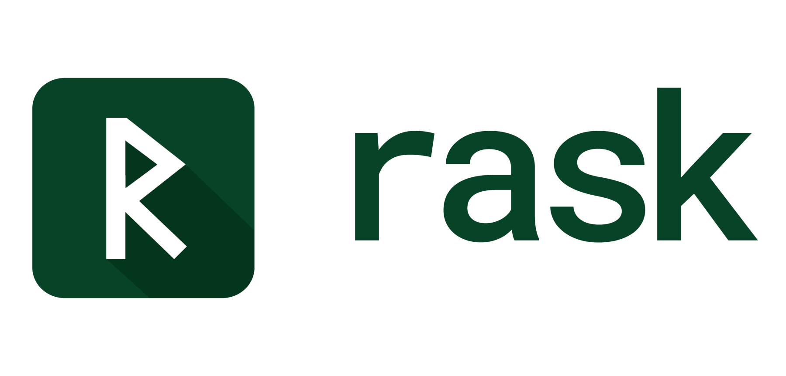
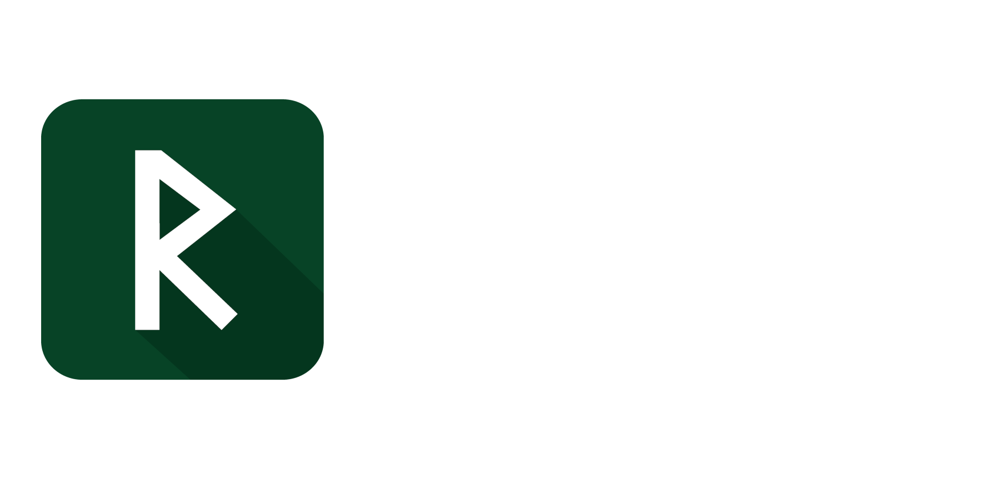

<p align="center">
  
  
</p>

# What Rask is

A systems language built around one bet: **if references can't be stored,
lifetime annotations stop being necessary.**

Borrow a value for a call or an expression and it works the way you'd expect.
Put the borrow in a struct field, or return it, and there's no syntax for what
you're asking — which is the point. Nothing outlives the thing it points at,
so there's nothing to track, and signatures carry types and nothing else.

Somewhere between Rust and Go. Closer to Rust on safety, closer to Go on
ceremony.

<!-- test: compile -->
```rask
import fs
import io

func grep(path: string, pat: string) -> void or io.IoError {
    mut file = try fs.open(path)
    ensure file.close()

    let text = try file.read_text()
    for line in text.lines() {
        if line.contains(pat) { println(line) }
    }
}
```

Three rules meet in those eight lines. `fs.open` hands back a linear resource
the compiler makes you consume exactly once. `ensure` defers that consumption
to the end of the scope. `try` returns early on failure — and because the
consumption is already scheduled, leaving early still closes the file. No
`defer` discipline to remember, no destructor running out of sight.

## Where to start

Rask is pre-0.1 and a solo project. Expect gaps in these chapters and bugs in
the compiler; the [issue tracker](https://github.com/rask-lang/rask/issues) is
the honest picture.

**New here.** [Install it](getting-started/installation.md), write [your first
program](getting-started/first-program.md), then read the chapters under *Learn
the language*. They take one concept at a time and say why each rule is the way
it is, which is the part the specs leave out. There are also
[exercises](https://github.com/rask-lang/rask/tree/main/tutorials/learn-rask) in
the repo. Nothing to install to look around: the [playground](/app/) runs Rask
in the browser.

**Already writing Rask.** The [language
card](https://github.com/rask-lang/rask/blob/main/LANGUAGE_CARD.md) is the whole
language on one page for looking a rule up. The [example
programs](examples/README.md) are complete and CI-checked. The
[specs](reference/specs-link.md) are the normative wording when the other two
disagree.

**Here for the design.** The
[writing](https://github.com/rask-lang/rask/tree/main/writing) is the long-form
argument; [CORE_DESIGN.md](https://github.com/rask-lang/rask/blob/main/specs/CORE_DESIGN.md)
is the principles it falls out of, and
[RULINGS.md](https://github.com/rask-lang/rask/blob/main/specs/RULINGS.md) is how
open questions get settled.
